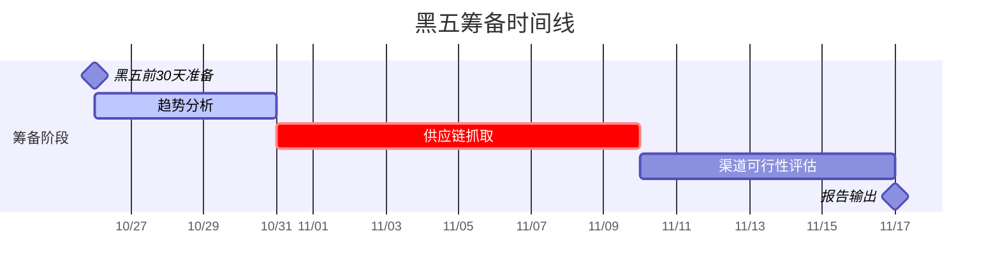

# 黑五筹备流程图

```mermaid
gantt
    title 黑五筹备时间线
    dateFormat  YYYY-MM-DD
    axisFormat  %m/%d
    section 筹备阶段
    黑五前30天准备       :milestone, m1, 2024-10-26, 0d
    趋势分析              :active, a1, after m1, 5d
    供应链抓取            :crit, a2, after a1, 10d
    渠道可行性评估        :a3, after a2, 7d
    报告输出              :milestone, m2, after a3, 0d
```

上述时间线展示了从黑五前30天启动，到趋势分析、供应链抓取、渠道可行性评估，再到最终报告输出的完整流程。
